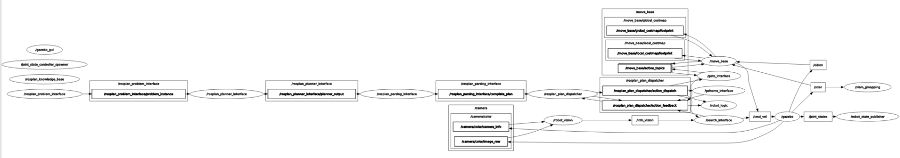

# Experimental Robotics Laboratory - Assignment 2

## Introduction

In this repository, the [ROS](https://www.ros.org) package `assignment_2` has been implemented to satisfy the requirements of the second assignment of the course [Experimental Robotics Laboratory](https://corsi.unige.it/en/off.f/2023/ins/66551?codcla=10635) of [Robotics Engineering](https://corsi.unige.it/en/corsi/10635) course by [University degli Studi di Genova](https://unige.it).  
The assignment depends on the [aruco](https://github.com/pal-robotics/aruco_ros/tree/noetic-devel/aruco) package for acquiring and parsing the image from the camera, [gmapping](http://wiki.ros.org/gmapping) package, for building the global and local map of the navigated environment, [move_base](http://wiki.ros.org/move_base) package to drive the rosbot toward the target with obstacle avoidance and the [ROSPlan](https://kcl-planning.github.io/ROSPlan/) framework for problem generation, planning and execution of the plan.  
The robot is a [Husarion ROSbot 2R](https://husarion.com/#robots) and its model is provided by the package [rosbot_description](https://github.com/husarion/rosbot_ros/tree/noetic/src/rosbot_description). The `ROSPlan` framework and the packages `aruco` and `rosbot_description` are included in this repository for convenience.  
The requirements for the assignment are the following:

- A mobile robot endowed with a camera must find all marker in a given environment and go back to the initial position.
- The positions of the marker are the following:
  - marker 11 is visible from the position x = 6.0, y = 2.0
  - marker 12 is visible from the position x = 7.0, y = -5.0
  - marker 13 is visible from the position x = -3.0, y = -8.0
  - marker 15 is visible from the position x = -7.0, y =-1.5
- The framework `ROSPlan` must be used to plan the actions of the robot
- The assignment must be implemented both in simulation (the world file assignment2.world is given) and with the real robot.

The requirements have been fulfilled as follows:

- this branch ([main](https://github.com/davideCaligola/experimentalRoboticsLab_assignment2))  
  implements the code for the simulation of the real rosbot. The architecture is based on a node implementing the logic for generating the plan using the `ROSPlan` framework, a node implementing the vision data handling using the `aruco` package, and three nodes which implement the actions used to execute the plan.
- branch [rosbot](https://github.com/davideCaligola/experimentalRoboticsLab_assignment2/tree/rosbot)  
  adapts the code in branch [main](https://github.com/davideCaligola/experimentalRoboticsLab_assignment2) into the code used to drive the real rosbot to perform the given tasks.

## Installation

Requirements:

- ROS Noetic environment is already installed and working properly,
- packages [move_base](http://wiki.ros.org/move_base) and [gmapping](http://wiki.ros.org/gmapping) properly installed. These packages are used to drive the rosbot and to create the global and local map of the environment.
- Git version control system properly installed,
- a proper Github SSH key setup (see [Adding a new SSH key to your GitHub account](https://docs.github.com/en/authentication/connecting-to-github-with-ssh/adding-a-new-ssh-key-to-your-github-account) for more information about it)

The software has been tested in a machine with Linux Ubuntu 20.04 LTS.  
The package `assignment_2` makes use of the terminal [xterm](https://invisible-island.net/xterm/) to provide information via a separated console.  
In Ubuntu, it is possible to install it using the apt command:  

```shell
sudo apt update && sudo apt -y install xterm
```

To use the packages in this repository, create a directory where a catkin workspace will be created for running the packages:

```bash
mkdir test_ws
```

Clone the repository in the test_ws/src folder:

```bash
git clone git@github.com:davideCaligola/experimentalRoboticsLab_assignment2.git test_ws/src
```

Navigate into the workspace folder and build the packages

```bash
cd test_ws
catkin_make
```

Setup the current workspace

```bash
source ./devel/setup.bash
```

Copy the marker models in the local directory `.gazebo`, otherwise the marker will not be visible in the Gazebo environment.

```bash
mkdir -p ~/.gazebo
cp -r ./src/assignment_2/aruco_models/* ~/.gazebo
```

## Use

The simulation can be started with the provided launch file:

```bash
roslaunch assignment_2 nav.launch
```

The Gazebo and RViz environments open showing the rosbot within the provided world with the markers.  
The rosbot will drive toward the first marker position. Once reached, it will turn looking for the marker. Once the marker is found, the rosbot will move toward the next marker.  
Once all markers have been found, the rosbot will drive toward the initial position, and once reached, the process terminates and closes all the started processes.  
An example of simulation run is shown in the following video.

https://github.com/davideCaligola/experimentalRoboticsLab_assignment2/assets/114524396/79079982-d13f-408c-ba0d-72de86266727

The following video shows the robot's behaviour in the real world.

## Architecture

The package is developed in five nodes:  

- [robot_logic.py](#robot_logicpy-source)
- [robot_vision.py](#robot_visionpy-source)
- [go-home_interface.cpp](#go-home_interfacecpp-source)
- [goto_interface.cpp](#goto_interfacecpp-source)
- [search_interface.cpp](#search_interfacecpp-source)

The developed nodes, the Gazebo and RViz environment are organized as shown in the following `rqt_graph`:



The following sections decribes in more details each developed node.

### robot_logic.py ([source](./assignment_2/script/robot_logic.py))
It interfaces with the `ROSPlan` framework to drive the rosbot to accomplish the task:

- generates the problem,
- generates the plan,
- parse the plan to make it `ROS` compatible,
- dispatches the actions to accomplish the task

It implements a simple state machine to send the requests  to the `ROSPlan` services, as represented in the following state machine:
  
*`robot_logic.py` node state machine*

### robot_vision.py ([source](./assignment_2/script/robot_vision.py))
It subscribes to the following camera topics:

- `/camera/color/camera_info`  
    to calculate the position of the camera center  
- `/camera/color/image_raw`  
    to extract information about the marker in view  

It publishes the topic `/info_vision`, which provides data about the current seen marker id and the four corners of the marker.

```C++
int32[] ids
float32[] camera_center
float32[] marker_center
float32[] marker_top_right
float32[] marker_top_left
float32[] marker_bottom_left
float32[] marker_bottom_right
```

*`/info_vision` topic*

### goto_interface.cpp ([source](./assignment_2/src/goto_interface.cpp))
It implements the `goto` action defined in the `domain`([source](./assignment_2/pddl/domain.pddl)).  
It receives the destination waypoint to reach from the dispatcher and sends the goal to the `move_base` package which drives the rosbot toward the target waypoint.

### go-home_interface.cpp ([source](./assignment_2/src/go-home_interface.cpp))
It implements the `go-home` action defined in the `domain`([source](./assignment_2/pddl/domain.pddl)).  
It receives the destination waypoint to reach from the dispatcher and sends the goal to the `move_base` package which drives the rosbot toward the target waypoint.

### search_interface.cpp ([source](./assignment_2/src/search_interface.cpp))
it implements the `search` action defined in the `domain`([source](./assignment_2/pddl/domain.pddl)).  

- It subscribes to the topic `/info_vision` to receive information about the current marker id seen by the camera.
- It receives from the dispatcher the marker id to look for.
- It sends to the rosbot the command to turn around itself until it finds the searched marker id.

## Improvements

The package can be improved considering the following points:

- there is not any error handling,
- the vision system handles only one marker per time. If more than a marker is in the camera view, only the first one in the list provided by the camera is considered,
- if the camera does not find the searched marker id, the rosbot keeps on turning on itself looking for the marker id indefinitely. It could be implemented a timeout or any other exception handler,
- once the rosbot reaches the target point, it takes time to get the notification from the `move_base` package that the service goal has been achieved. It could be possible to speed up the process introducing a check on the position of the robot and once reached the target position within a threshold, cancel the `move_base` service goal,
- currently, once the rosbot comes back to the starting point, the `robot_logic.py` node terminates. Since the node is required, its termination triggers all other processes to terminate as well. A more graceful shut down procedure could be devised.
